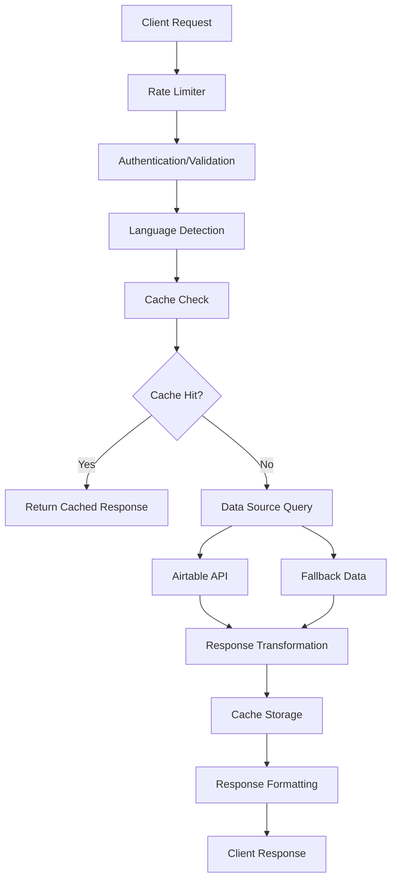

# ANAM Gallery API Design Specification

## Overview

This document outlines the comprehensive API design for the ANAM Korean
Calligraphy Gallery system, focusing on RESTful principles, Korean cultural
context, and optimal performance for art gallery applications.

## 🏗️ API Architecture

### Core Principles

1. **RESTful Design**: Standard HTTP methods and status codes
2. **Korean-First**: Native Korean language support with i18n
3. **Art-Centric**: Optimized for artwork and gallery operations
4. **Performance**: Caching, pagination, and optimization
5. **Type Safety**: Full TypeScript integration
6. **Accessibility**: Support for screen readers and assistive technologies

### Base Configuration

```typescript
const API_CONFIG = {
  baseURL: 'https://anam.orientalcalligraphy.org/api',
  version: 'v1',
  timeout: 30000,
  rateLimit: {
    requests: 100,
    windowMs: 60000, // 1 minute
  },
  supportedLanguages: ['ko', 'en', 'ja', 'zh'],
  defaultLanguage: 'ko',
}
```

## 📚 API Endpoints

### 1. Artworks API

#### GET /api/artworks

Retrieve paginated artwork collection with filtering and sorting.

```typescript
interface ArtworksQueryParams {
  page?: number              // Default: 1
  limit?: number            // Default: 12, Max: 50
  year?: string             // Filter by year
  medium?: string           // Filter by medium/technique
  category?: string         // Filter by category
  search?: string           // Full-text search (Korean/English)
  sortBy?: 'year' | 'title' | 'featured' | 'created_at'
  sortOrder?: 'asc' | 'desc' // Default: 'desc'
  lang?: 'ko' | 'en' | 'ja' | 'zh' // Default: 'ko'
}

interface ArtworksResponse {
  data: Artwork[]
  metadata: {
    pagination: {
      currentPage: number
      totalPages: number
      totalItems: number
      itemsPerPage: number
      hasNextPage: boolean
      hasPrevPage: boolean
    }
    filters: {
      availableYears: string[]
      availableMediums: string[]
      availableCategories: string[]
    }
    timestamp: string
    language: string
  }
}

// Example usage
GET /api/artworks?page=1&limit=12&year=2024&medium=墨&search=좋은%20날&lang=ko
```

#### GET /api/artworks/[slug]

Retrieve specific artwork by slug with full details.

```typescript
interface ArtworkDetailResponse {
  data: ArtworkWithDetails
  metadata: {
    relatedArtworks: Artwork[] // 3-5 related pieces
    previousArtwork?: Artwork
    nextArtwork?: Artwork
    viewCount: number
    timestamp: string
    language: string
  }
}

interface ArtworkWithDetails extends Artwork {
  // Extended fields for detail view
  culturalContext: string    // 문화적 맥락
  technique: string         // 기법 설명
  symbolism: string         // 상징성
  inspiration: string       // 영감의 원천
  creationStory: string     // 창작 과정
  exhibitions: Exhibition[] // 전시 이력
}

// Example usage
GET /api/artworks/anam-good-day-2024?lang=ko
```

#### GET /api/artworks/featured

Retrieve featured artworks for homepage display.

```typescript
interface FeaturedArtworksResponse {
  data: {
    hero: Artwork // Main featured artwork
    highlights: Artwork[] // 3-4 highlighted pieces
    recent: Artwork[] // 6-8 recent works
    popular: Artwork[] // 4-6 most viewed
  }
  metadata: {
    timestamp: string
    cacheExpiresAt: string
    language: string
  }
}
```

### 2. Artist API

#### GET /api/artist

Retrieve artist information with comprehensive biography.

```typescript
interface ArtistResponse {
  data: ArtistWithDetails
  metadata: {
    artworkCount: number
    exhibitionCount: number
    awardCount: number
    timestamp: string
    language: string
  }
}

interface ArtistWithDetails extends Artist {
  // Localized content
  bio: Record<string, string> // Multi-language biography
  statement: Record<string, string> // Artist statement
  philosophy: Record<string, string> // Artistic philosophy

  // Structured data
  timeline: ArtistTimelineEvent[] // Career timeline
  achievements: Achievement[] // Awards and recognitions
  exhibitions: Exhibition[] // Exhibition history
  publications: Publication[] // Books and articles
  media: MediaItem[] // Videos, interviews
}

interface ArtistTimelineEvent {
  year: number
  type: 'exhibition' | 'award' | 'education' | 'milestone'
  title: Record<string, string> // Multi-language title
  description: Record<string, string> // Multi-language description
  location?: string
  importance: 'major' | 'significant' | 'notable'
}
```

### 3. Search API

#### GET /api/search

Advanced search across all content with Korean language optimization.

```typescript
interface SearchQueryParams {
  q: string // Search query
  type?: 'artworks' | 'artist' | 'all' // Default: 'all'
  filters?: {
    year?: string[]
    medium?: string[]
    category?: string[]
  }
  page?: number
  limit?: number
  lang?: string
}

interface SearchResponse {
  data: {
    artworks?: SearchResultArtwork[]
    artist?: SearchResultArtist
    suggestions?: string[] // Search suggestions
  }
  metadata: {
    query: string
    totalResults: number
    searchTime: number // Response time in ms
    pagination: PaginationMeta
    language: string
    koreanTokens?: string[] // Korean word analysis
  }
}

// Korean search optimization
interface KoreanSearchFeatures {
  hangulDecomposition: boolean // ㄱ, ㅏ, ㄴ analysis
  synonymExpansion: boolean // 서예 = 캘리그래피
  culturalTerms: boolean // Traditional term recognition
  phoneticMatching: boolean // Sound-based matching
}
```

### 4. Contact API

#### POST /api/contact

Handle contact form submissions with Korean language support.

```typescript
interface ContactRequestBody {
  name: string // 이름
  email: string // 이메일
  phone?: string // 전화번호 (optional)
  subject: string // 제목
  message: string // 메시지
  inquiry_type: 'general' | 'artwork' | 'exhibition' | 'media' | 'collaboration'
  artwork_interest?: string // If artwork inquiry
  language: 'ko' | 'en' | 'ja' | 'zh'
  newsletter_signup?: boolean
  recaptcha_token: string // reCAPTCHA verification
}

interface ContactResponse {
  success: boolean
  data: {
    message_id: string
    estimated_response_time: string // e.g., "2-3 business days"
    auto_reply_sent: boolean
  }
  metadata: {
    timestamp: string
    language: string
  }
}

// Validation schema
const contactSchema = z.object({
  name: z.string().min(2, '이름은 2자 이상이어야 합니다').max(50),
  email: z.string().email('올바른 이메일 주소를 입력해주세요'),
  phone: z
    .string()
    .regex(/^[\d\-\+\(\)\s]+$/, '올바른 전화번호를 입력해주세요')
    .optional(),
  subject: z.string().min(5, '제목은 5자 이상이어야 합니다').max(100),
  message: z.string().min(10, '메시지는 10자 이상이어야 합니다').max(2000),
  inquiry_type: z.enum([
    'general',
    'artwork',
    'exhibition',
    'media',
    'collaboration',
  ]),
  language: z.enum(['ko', 'en', 'ja', 'zh']),
  recaptcha_token: z.string().min(1, 'reCAPTCHA 인증이 필요합니다'),
})
```

### 5. Performance API

#### GET /api/performance

Retrieve application performance metrics for monitoring.

```typescript
interface PerformanceResponse {
  data: {
    server: {
      responseTime: number // Average response time
      uptime: number // Server uptime
      memoryUsage: number // Memory usage percentage
      cacheHitRate: number // Cache hit rate percentage
    }
    client: {
      pageLoadTime: number // Average page load time
      coreWebVitals: {
        lcp: number // Largest Contentful Paint
        fid: number // First Input Delay
        cls: number // Cumulative Layout Shift
      }
      errorRate: number // Client error rate
    }
    content: {
      artworkViews: number // Total artwork views
      searchQueries: number // Search queries count
      contactSubmissions: number // Contact form submissions
    }
  }
  metadata: {
    period: string // '24h', '7d', '30d'
    timestamp: string
  }
}
```

### 6. Admin API (Protected)

#### POST /api/admin/revalidate

Trigger ISR revalidation for specific content.

```typescript
interface RevalidateRequestBody {
  paths?: string[] // Specific paths to revalidate
  tags?: string[] // Cache tags to invalidate
  type: 'artwork' | 'artist' | 'all'
  reason?: string // Reason for revalidation
}

interface RevalidateResponse {
  success: boolean
  data: {
    revalidatedPaths: string[]
    invalidatedTags: string[]
    timestamp: string
  }
  metadata: {
    triggeredBy: string // Admin user identifier
    estimatedPropagation: string // e.g., "30-60 seconds"
  }
}
```

## 🔄 Data Flow Architecture

### Request/Response Flow



### Caching Strategy

```typescript
const cacheConfiguration = {
  // Browser Cache (Service Worker)
  static: {
    duration: '1 year',
    assets: ['images', 'fonts', 'icons'],
  },

  // Edge Cache (Vercel)
  api: {
    artworks: '1 hour',
    artist: '6 hours',
    search: '30 minutes',
  },

  // Application Cache (React Query)
  client: {
    artworks: '10 minutes',
    artist: '1 hour',
    search: '5 minutes',
  },

  // Database Cache
  airtable: {
    revalidation: 'on-demand',
    fallback: 'stale-while-revalidate',
  },
}
```

## 🛡️ Security & Validation

### Input Validation

```typescript
// Korean text validation
const koreanTextSchema = z
  .string()
  .min(1, '내용을 입력해주세요')
  .max(1000, '1000자 이하로 입력해주세요')
  .regex(
    /^[\uAC00-\uD7AF\u1100-\u11FF\u3130-\u318F\uA960-\uA97F\uD7B0-\uD7FF\s\w\d\p{P}]*$/u,
    '한글, 영문, 숫자, 기본 문장부호만 입력 가능합니다'
  )

// Email validation with Korean domain support
const emailSchema = z
  .string()
  .email('올바른 이메일 주소를 입력해주세요')
  .refine((email) => {
    const koreanDomains = ['naver.com', 'daum.net', 'hanmail.net', 'gmail.com']
    return (
      koreanDomains.some((domain) => email.endsWith(domain)) ||
      /^[a-zA-Z0-9._%+-]+@[a-zA-Z0-9.-]+\.[a-zA-Z]{2,}$/.test(email)
    )
  }, '지원되는 이메일 도메인을 사용해주세요')
```

### Rate Limiting

```typescript
const rateLimitConfig = {
  // API endpoints
  '/api/artworks': { requests: 100, window: '1m' },
  '/api/search': { requests: 50, window: '1m' },
  '/api/contact': { requests: 5, window: '10m' },
  '/api/admin/*': { requests: 20, window: '1m' },

  // IP-based limits
  global: { requests: 200, window: '1m' },

  // Burst protection
  burst: { requests: 10, window: '1s' },
}
```

### Error Handling

```typescript
interface ApiError {
  code: string
  message: Record<string, string> // Multi-language error messages
  details?: any
  timestamp: string
  requestId: string
}

const errorMessages = {
  VALIDATION_ERROR: {
    ko: '입력값이 올바르지 않습니다',
    en: 'Invalid input provided',
    ja: '入力値が正しくありません',
    zh: '输入值不正确',
  },
  RATE_LIMIT_EXCEEDED: {
    ko: '요청 한도를 초과했습니다. 잠시 후 다시 시도해주세요',
    en: 'Rate limit exceeded. Please try again later',
    ja: 'レート制限を超えました。しばらくしてから再試行してください',
    zh: '超出请求限制。请稍后再试',
  },
  ARTWORK_NOT_FOUND: {
    ko: '작품을 찾을 수 없습니다',
    en: 'Artwork not found',
    ja: '作品が見つかりません',
    zh: '找不到作品',
  },
}
```

## 📊 Response Formats

### Standard Response Structure

```typescript
interface StandardApiResponse<T> {
  success: boolean
  data: T
  metadata: ResponseMetadata
  error?: ApiError
}

interface ResponseMetadata {
  timestamp: string
  requestId: string
  version: string
  language: string
  executionTime?: number
  cacheStatus?: 'hit' | 'miss' | 'stale'
  warnings?: string[]
}
```

### Pagination Format

```typescript
interface PaginatedResponse<T> extends StandardApiResponse<T[]> {
  metadata: ResponseMetadata & {
    pagination: {
      currentPage: number
      totalPages: number
      totalItems: number
      itemsPerPage: number
      hasNextPage: boolean
      hasPrevPage: boolean
      nextPageUrl?: string
      prevPageUrl?: string
    }
  }
}
```

## 🌐 Internationalization (i18n)

### Language Support

```typescript
interface LocalizedContent {
  ko: string // Korean (primary)
  en: string // English
  ja?: string // Japanese (optional)
  zh?: string // Chinese (optional)
}

interface ArtworkLocalized {
  title: LocalizedContent
  description: LocalizedContent
  artistNote: LocalizedContent
  technique: LocalizedContent
  inspiration: LocalizedContent
  symbolism: LocalizedContent
  culturalContext: LocalizedContent
}
```

### Content Negotiation

```typescript
// Language detection priority
const languageDetection = {
  1: 'Accept-Language header',
  2: 'URL query parameter (?lang=ko)',
  3: 'Cookie preference',
  4: 'User-Agent analysis',
  5: 'Default to Korean',
}

// RTL support for future Arabic content
const textDirection = {
  ko: 'ltr',
  en: 'ltr',
  ja: 'ltr',
  zh: 'ltr',
  ar: 'rtl', // Future support
}
```

## 🚀 Performance Optimization

### Response Compression

```typescript
const compressionConfig = {
  gzip: {
    threshold: 1024, // Minimum size to compress
    level: 6, // Compression level (1-9)
    memLevel: 8, // Memory usage (1-9)
  },
  brotli: {
    enabled: true,
    quality: 4, // Quality level (0-11)
    lgwin: 22, // Window size
  },
}
```

### Content Delivery

```typescript
const cdnConfiguration = {
  images: {
    formats: ['avif', 'webp', 'jpg'],
    sizes: [300, 600, 1200, 1920],
    quality: [80, 85, 90],
    caching: '1 year',
  },

  api: {
    edge_locations: ['Seoul', 'Tokyo', 'Singapore'],
    cache_control: 'public, max-age=3600, s-maxage=7200',
    vary: 'Accept-Language, Accept-Encoding',
  },
}
```

## 📈 Monitoring & Analytics

### API Metrics

```typescript
interface ApiMetrics {
  endpoints: Record<string, EndpointMetrics>
  overall: {
    requestsPerMinute: number
    averageResponseTime: number
    errorRate: number
    cacheHitRate: number
  }
  geographic: {
    korea: number // Requests from Korea
    international: number
    topCountries: string[]
  }
}

interface EndpointMetrics {
  requests: number
  averageResponseTime: number
  p95ResponseTime: number
  errorRate: number
  cacheHitRate: number
  uniqueUsers: number
}
```

### Cultural Analytics

```typescript
interface CulturalMetrics {
  language_preferences: Record<string, number>
  popular_search_terms: {
    korean: string[]
    english: string[]
    japanese: string[]
    chinese: string[]
  }
  artwork_engagement: {
    traditional_vs_modern: {
      traditional: number
      modern: number
    }
    medium_preferences: Record<string, number>
    time_spent_per_artwork: number
  }
}
```

## 🔧 Development & Testing

### API Testing Strategy

```typescript
// Test categories
const testSuites = {
  unit: {
    validation: 'Input validation schemas',
    transformers: 'Data transformation functions',
    utilities: 'Helper functions',
  },

  integration: {
    airtable: 'Airtable API integration',
    cache: 'Caching layer functionality',
    i18n: 'Internationalization features',
  },

  e2e: {
    user_flows: 'Complete user journey testing',
    performance: 'Performance benchmark testing',
    accessibility: 'Screen reader and keyboard navigation',
  },

  korean_specific: {
    text_processing: 'Korean text handling',
    search: 'Korean search functionality',
    cultural_content: 'Cultural context accuracy',
  },
}
```

### API Documentation

```typescript
// OpenAPI 3.0 specification with Korean annotations
const apiDocumentation = {
  openapi: '3.0.0',
  info: {
    title: 'ANAM Gallery API',
    description: '아남 배옥영 서예 갤러리 API 문서',
    version: '1.0.0',
    contact: {
      name: 'ANAM Gallery Support',
      email: 'support@anam.orientalcalligraphy.org',
    },
  },
  servers: [
    {
      url: 'https://anam.orientalcalligraphy.org/api',
      description: 'Production server (프로덕션 서버)',
    },
  ],
}
```

## 💡 Future Enhancements

### Advanced Features

1. **AI-Powered Recommendations**
   - Artwork similarity analysis
   - User preference learning
   - Cultural context suggestions

2. **Real-time Features**
   - Live exhibition updates
   - Real-time visitor analytics
   - Interactive gallery tours

3. **Enhanced Search**
   - Voice search in Korean
   - Image-based search
   - Calligraphy style recognition

4. **Cultural Integration**
   - Traditional calendar integration
   - Seasonal artwork recommendations
   - Cultural event synchronization

---

_This API specification ensures optimal performance, cultural sensitivity, and
user experience for the ANAM Korean Calligraphy Gallery platform._
